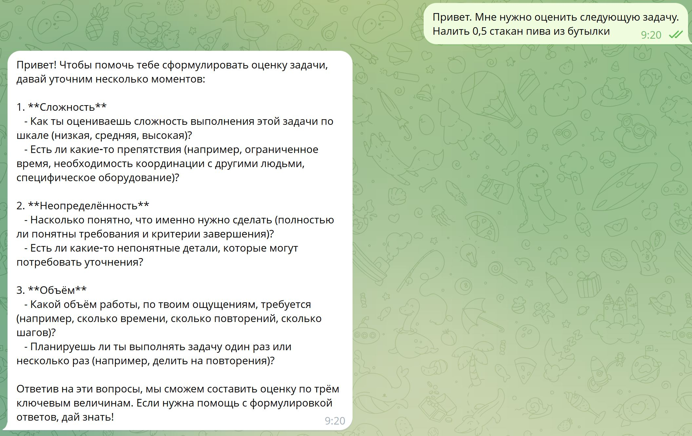

# 🤖 TEA - Task Estimation Assistant

> **Telegram-бот для помощи в оценке задач**

Интеллектуальный помощник с интеграцией LLM, который помогает определить три ключевые величины для любой задачи: **СЛОЖНОСТЬ**, **НЕОПРЕДЕЛЕННОСТЬ** и **ОБЪЕМ**.

[](https://www.python.org/downloads/)
[](https://docs.aiogram.dev/)
[](https://openrouter.ai/)
[]()

---

## 📖 О проекте

**TEA (Task Estimation Assistant)** - это Telegram-бот, который помогает в процессе оценки задач, фокусируясь на трех ключевых величинах:

- **СЛОЖНОСТЬ** - насколько задача сложна в реализации
- **НЕОПРЕДЕЛЕННОСТЬ** - насколько понятны требования и подходы к решению
- **ОБЪЕМ** - сколько работы требуется для выполнения

### Уникальный подход

Бот **НЕ** анализирует техническую суть задачи. Вместо этого он:
- 🎯 Задает наводящие вопросы о вашем восприятии
- 💬 Анализирует только ваши ответы
- 📊 Помогает структурировать оценку по трем величинам
- 🧠 Помнит контекст диалога для последовательной беседы

---

## ✨ Основные возможности

### 🤖 Функциональность
- ✅ Интерактивный диалог с наводящими вопросами
- ✅ Оценка по трем величинам: сложность, неопределенность, объем
- ✅ Контекст диалога (хранение 10 пар вопрос-ответ)
- ✅ Разбивка длинных ответов (до 4096 символов)

### 🛡️ Надежность
- ✅ Детальная обработка ошибок (таймаут, сеть, API, rate limit)
- ✅ Мониторинг производительности (WARNING для медленных ответов >20 сек)
- ✅ Полное логирование всех операций (app.log, errors.log)
- ✅ Graceful shutdown

### 🔧 Техническое качество
- ✅ Строгая типизация (type hints)
- ✅ Docstrings для всех классов и методов
- ✅ Архитектура: 1 класс = 1 файл (KISS принцип)
- ✅ Конфигурация через .env с валидацией Pydantic

---

## 🎬 Демонстрация

### Пример работы бота



*Скриншот реального диалога с ботом: бот задает наводящие вопросы по трем величинам (СЛОЖНОСТЬ, НЕОПРЕДЕЛЕННОСТЬ, ОБЪЕМ)*

### Типичный сценарий взаимодействия

```
👤 Пользователь: Привет. Мне нужно оценить следующую задачу.
                 Налить 0,5 стакан пива из бутылки

🤖 Бот: Чтобы помочь тебе сформулировать оценку задачи, давай уточним несколько моментов:

        1. **Сложность**
           - Как ты оцениваешь сложность выполнения этой задачи по шкале...
           - Есть ли какие-то препятствия...
        
        2. **Неопределённость**
           - Насколько понятно, что именно нужно сделать...
           - Есть ли какие-то непонятные детали...
        
        3. **Объём**
           - Какой объём работы, по твоим ощущениям, требуется...
           - Планируешь ли ты выполнять задачу один раз или несколько раз...
```

> 📸 **Совет:** Запустите бота самостоятельно и оцените удобство интерфейса!

---

## 🛠️ Технологический стек

### Основные технологии
| Технология | Версия | Описание |
|------------|--------|----------|
| **Python** | 3.10+ | Основной язык разработки |
| **aiogram** | 3.x | Telegram Bot API фреймворк |
| **OpenRouter** | API | LLM провайдер (OpenAI-compatible) |
| **uv** | latest | Управление зависимостями |
| **Pydantic** | 2.x | Валидация конфигурации |

### Дополнительные библиотеки
- **python-dotenv** - загрузка переменных окружения
- **openai** - Python client для работы с LLM
- **logging** (встроенный) - логирование операций

### Архитектурные принципы
- 🎯 **KISS** - Keep It Simple, Stupid
- 🏗️ **ООП** - 1 класс = 1 файл
- 📝 **Type Hints** - строгая типизация
- 📚 **Docstrings** - документация кода
- ⚡ **Fail-fast** - быстрое падение при ошибках

---

## 📋 Требования

Перед установкой убедитесь, что у вас есть:

- ✅ Python 3.10 или выше
- ✅ uv (инструмент управления зависимостями)
- ✅ Telegram Bot Token (получить у [@BotFather](https://t.me/BotFather))
- ✅ OpenRouter API Key (получить на [openrouter.ai](https://openrouter.ai/))

---

## 🚀 Установка и запуск

### Шаг 1: Клонирование репозитория

```bash
git clone <repository-url>
cd TEARepo
```

### Шаг 2: Установка зависимостей

Убедитесь, что у вас установлен [uv](https://github.com/astral-sh/uv):

```bash
# Установка uv (если еще не установлен)
curl -LsSf https://astral.sh/uv/install.sh | sh

# Установка зависимостей проекта
make setup
```

### Шаг 3: Настройка конфигурации

1. Скопируйте файл с примером конфигурации:
```bash
cp .env.example .env
```

2. Откройте `.env` и заполните обязательные параметры:

```env
# Telegram Bot (ОБЯЗАТЕЛЬНО)
TELEGRAM_BOT_TOKEN=your_telegram_token_here

# OpenRouter LLM (ОБЯЗАТЕЛЬНО)
OPENROUTER_API_KEY=your_openrouter_key_here

# Опционально (значения по умолчанию)
OPENROUTER_MODEL=openai/gpt-oss-20b:free
MAX_HISTORY_MESSAGES=20
LLM_TIMEOUT=30
LOG_LEVEL=INFO
```

#### 🔑 Как получить токены

<details>
<summary><b>📱 Telegram Bot Token</b></summary>

1. Откройте Telegram и найдите [@BotFather](https://t.me/BotFather)
2. Отправьте команду `/newbot`
3. Введите имя бота (например: "Task Estimation Assistant")
4. Введите username бота (должен заканчиваться на "bot", например: "tea_assistant_bot")
5. Скопируйте полученный токен в формате `123456789:ABCdefGHIjklMNOpqrsTUVwxyz`
</details>

<details>
<summary><b>🔐 OpenRouter API Key</b></summary>

1. Перейдите на [openrouter.ai](https://openrouter.ai/)
2. Зарегистрируйтесь или войдите в аккаунт
3. Перейдите в раздел "API Keys"
4. Нажмите "Create API Key"
5. Скопируйте созданный ключ в формате `sk-or-v1-...`
</details>

### Шаг 4: Запуск бота

```bash
make run
```

✅ Бот запустится и будет готов к работе!

Вы увидите в логах:
```
Bot is ready to receive messages
Run polling for bot @your_bot_name
```

### Команды Make

```bash
make setup   # Установка зависимостей через uv
make run     # Запуск бота
make clean   # Очистка временных файлов и виртуального окружения
```

## 📁 Структура проекта

```
TEARepo/
├── src/
│   ├── bot/                    # Telegram бот
│   │   ├── telegram_bot.py     # Основной класс бота
│   │   └── message_handler.py  # Обработчики сообщений
│   ├── llm/                    # Работа с LLM
│   │   ├── llm_client.py       # Клиент OpenRouter
│   │   └── conversation.py     # История диалогов
│   ├── config/                 # Конфигурация
│   │   └── settings.py         # Настройки через Pydantic
│   └── main.py                 # Точка входа
├── prompts/                    # Системные промпты
│   └── system_prompt.txt       # Роль и инструкции для ассистента
├── logs/                       # Логи приложения
│   ├── app.log                 # Все логи
│   └── errors.log              # Только ошибки
├── docs/                       # Документация
├── .env                        # Конфигурация (не в git)
├── .env.example                # Пример конфигурации
├── pyproject.toml              # Зависимости
├── Makefile                    # Команды автоматизации
└── README.md                   # Этот файл
```

---

## 💡 Использование

### Доступные команды

| Команда | Описание |
|---------|----------|
| `/start` | Начать работу с ботом и увидеть приветствие |
| `/help` | Получить подробную справку по использованию |
| `/role` | Показать роль и специализацию ассистента |

### 🎯 Как работать с ботом

1. **Начните диалог** с любого сообщения о задаче
2. **Отвечайте на вопросы** бота о вашем восприятии задачи
3. **Получите структурированную оценку** по трем величинам

### Пример взаимодействия

```
👤 Вы: Мне нужно оценить задачу

🤖 Бот: Насколько понятно вам, что именно нужно сделать?

👤 Вы: В целом понятно, но есть несколько неясных моментов по интеграции

🤖 Бот: Как вы оцениваете сложность реализации - высокая, средняя или низкая?

👤 Вы: Я бы сказал средняя сложность

🤖 Бот: Сколько времени, по вашим ощущениям, может занять эта работа?

👤 Вы: Примерно неделя

🤖 Бот: [Помогает сформулировать итоговую оценку]
```

### ✨ Особенности

- 💬 **Контекст диалога**: Бот помнит последние 10 пар вопрос-ответ
- 🔄 **Непрерывный диалог**: Можно задавать уточняющие вопросы
- 📄 **Длинные ответы**: Автоматически разбиваются на части (лимит Telegram 4096 символов)
- ⚡ **Быстрые ответы**: Среднее время ответа 3-20 секунд

## 🛠️ Команды Make

```bash
make setup    # Установка зависимостей
make run      # Запуск бота
make clean    # Очистка временных файлов
```

## 📊 Логирование

Логи записываются в директорию `logs/`:

- `app.log` - все логи (INFO, WARNING, ERROR)
- `errors.log` - только ошибки (ERROR)

Уровень логирования настраивается в `.env`:

```env
LOG_LEVEL=INFO  # DEBUG, INFO, WARNING, ERROR
```

## 🔧 Конфигурация

### Переменные окружения (.env)

Все настройки в файле `.env`:

| Параметр | Описание | По умолчанию |
|----------|----------|--------------|
| `TELEGRAM_BOT_TOKEN` | Токен Telegram бота | **Обязательно** |
| `OPENROUTER_API_KEY` | API ключ OpenRouter | **Обязательно** |
| `OPENROUTER_MODEL` | Модель LLM | `openai/gpt-oss-20b:free` |
| `MAX_HISTORY_MESSAGES` | Лимит истории (сообщений) | `20` |
| `LLM_TIMEOUT` | Таймаут запросов (сек) | `30` |
| `LOG_LEVEL` | Уровень логирования | `INFO` |

### Системный промпт (prompts/system_prompt.txt)

Роль и поведение ассистента настраиваются через файл `prompts/system_prompt.txt`. 

**Преимущества внешнего промпта:**
- ✅ Изменение роли без перезапуска кода
- ✅ Быстрая итерация и тестирование промптов
- ✅ Версионирование промптов через Git
- ✅ Легкая адаптация бота под разные задачи

**Пример настройки:**
```bash
# Отредактируйте файл
nano prompts/system_prompt.txt

# Перезапустите бота для применения изменений
make run
```

💡 **Совет:** Команда `/role` показывает текущую роль ассистента, загруженную из файла

## 🏗️ Архитектура

Проект следует принципам:
- **KISS** - максимальная простота
- **ООП** - 1 класс = 1 файл
- **Type hints** - строгая типизация
- **Docstrings** - документация кода

### Основные компоненты:

- **TelegramBot** - инициализация aiogram, регистрация handlers
- **MessageHandler** - обработка команд и сообщений
- **LLMClient** - работа с OpenRouter API
- **Conversation** - in-memory хранение истории диалогов
- **Settings** - конфигурация через Pydantic

## ⚠️ Ограничения MVP

- ❌ Нет персистентности (история теряется при перезапуске)
- ❌ Нет базы данных
- ❌ Нет мультимодальности (только текст)
- ❌ Нет rate limiting
- ❌ Нет команды /reset

## 📝 Разработка

### Принципы разработки

Следуйте принципам из `docs/vision.md`:

1. Один класс = один файл
2. Type hints для всех параметров
3. Docstrings для классов и методов
4. Простой и читаемый код
5. Никакого оверинжиниринга

### Тестирование

Проект использует pytest для тестирования. Все тесты находятся в директории `tests/`.

**Запуск тестов:**
```bash
# Все тесты
make test

# С покрытием кода
uv run pytest tests/ --cov=src --cov-report=term-missing

# HTML отчёт о покрытии
uv run pytest tests/ --cov=src --cov-report=html
```

**Test Explorer UI в Cursor/VS Code:**

Для удобной работы с тестами настроен Test Explorer UI:
- 🧪 Откройте панель Testing (иконка колбы в боковой панели)
- ▶️ Запускайте тесты одним кликом
- 🐛 Отлаживайте тесты с breakpoints
- 📊 Визуально отслеживайте статус тестов

📖 **Документация:**
- 🚀 [Quick Start Guide](docs/test_ui_quickstart.md) - быстрый старт за 30 секунд
- 📚 [Полное руководство](docs/testing_ui_guide.md) - детальная документация

### Качество кода

```bash
# Форматирование
make format

# Линтинг
make lint

# Проверка типов
make typecheck

# Полная проверка качества
make quality
```

## 📄 Лицензия

Проект создан для проверки идеи MVP.

## 🤝 Контакты

По вопросам и предложениям создавайте Issues в репозитории.

---

**Статус проекта:** MVP+ ✅

Все 7 итераций разработки завершены:
- ✅ Итерация 1: Настройка проекта
- ✅ Итерация 2: Базовый Telegram бот
- ✅ Итерация 3: Интеграция LLM
- ✅ Итерация 4: Контекст диалога
- ✅ Итерация 5: Обработка ошибок
- ✅ Итерация 6: Финальная полировка
- ✅ Итерация 7: Команда /role и внешний системный промпт

